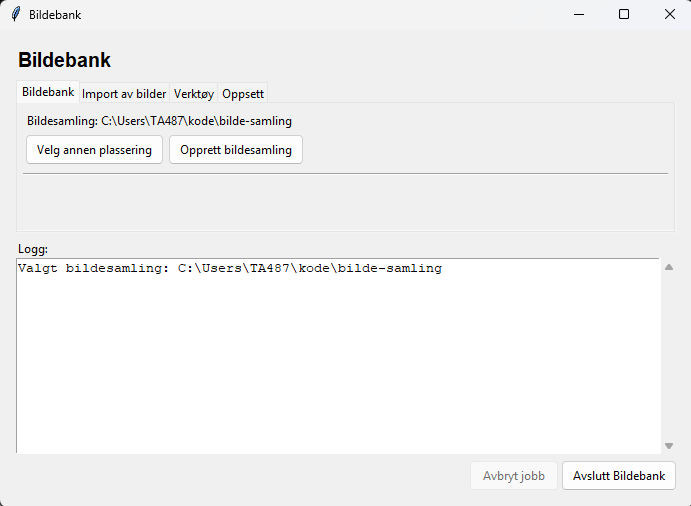

# Hva er dette?

Bildebank er et program som kopierer bilder og videoer fra gamle mapper,
minnekort, USB-disker og CD-er inn i én ryddig bildesamling sortert etter dato.

Noen prinsipper som ligger til grunn for Bildebank:

- Programmet skal ikke endre mappene det henter bilder fra. Alle bilder
  kopieres inn i en ny mappestruktur.
- Den nye bildesamlingen skal kunne brukes uten at Bildebank er installert.
  Du skal kunne kopiere samlingen til en annen PC og bla i bildene med vanlige
  filverktøy eller med en generert HTML-fil.
- Du skal kunne se hvilken mappe, CD, USB-disk eller minnebrikke bildene
  opprinnelig kom fra.
- Programmet skal unngå å importere duplikater.

# Installasjon

Denne oppskriften er skrevet for Windows 11 og for deg som ikke
er vant til å bruke PowerShell eller andre terminalvinduer.

Hvis du bruker Linux eller WSL, se [README.linux.md](README.linux.md).

## Anbefalt installasjon

Høyreklikk [setup-windows.ps1](https://raw.githubusercontent.com/tcamundsen/bildebank/refs/heads/main/setup-windows.ps1)
og velg "Lagre linken som..."

1. Åpne PowerShell. Det gjør du ved å åpne startmenyen og begynne å skrive "PowerShell". Klikk på
   PowerShell-logoen som dukker opp. Du skal ikke velge "Run as Administrator" eller
   "PowerShell ISE".
2. Skriv dette i PowerShell for å gå til nedlastingsmappen:

```powershell
cd $HOME\Downloads
```

3. Kjør scriptet:

```powershell
powershell.exe -ExecutionPolicy Bypass -File .\setup-windows.ps1
```

Hvis du vil testinstallere i en annen mappe og bruke et annet kommandonavn,
kan du for eksempel kjøre:

```powershell
powershell.exe -ExecutionPolicy Bypass -File .\setup-windows.ps1 -InstallDir "$HOME\kode\bildebank-test" -CommandName bb2
```

Når scriptet er ferdig, **lukk PowerShell og åpne PowerShell på nytt**. Da skal du
kunne skrive:

```powershell
bildebank start
```

Programmet vil da åpne dette vinduet:



Hvis dette fungerer kan du fortsette med å lese
[Kom i gang med bildebank](docs/web/kom-i-gang.md).

Hvis dette ikke virker, ble ikke installasjonen ferdig.

Da er det på tide å ta kontakt med Tom Cato.

# Komplisert forklaring du ikke trenger å se på :-)

Hvis scriptet ikke får installert Git eller Python automatisk, kan du følge den
manuelle oppskriften under. Men jeg foreslår egentlig at du ringer Tom Cato som
kan finne ut hvorfor ikke automatikken fungerer.

## Kortversjon hvis setup-windows.ps1 feiler

Du trenger:

1. Git for Windows
2. Python 3.13 eller nyere
3. En lokal kopi av programmet fra GitHub
4. En Python-venv i programmappen

## Installer Git for Windows

1. Gå til <https://git-scm.com/download/win>
2. Last ned Git for Windows.
3. Kjør installasjonsprogrammet.
4. Bruk standardvalgene hvis du er usikker.

Etterpå åpner du PowerShell og sjekker at Git virker:

```powershell
git --version
```

Hvis du får et versjonsnummer, er Git installert.

## Installer Python

1. Gå til <https://www.python.org/downloads/windows/>
2. Last ned Python 3.13 eller nyere.
3. Start installasjonsprogrammet.
4. Huk av for `Add python.exe to PATH` hvis valget vises.
5. Velg vanlig installasjon.

Sjekk etterpå i PowerShell:

```powershell
py -3.13 --version
```

Hvis du får et versjonsnummer på 3.13 eller nyere, er Python klar.

## Last ned programmet fra GitHub

Velg først en mappe der du vil ha selve programkoden. Eksempelet under lager
en mappe `kode` under hjemmemappen din:

```powershell
mkdir $HOME\kode
cd $HOME\kode
```

Last ned programmet:

```powershell
git clone https://github.com/tcamundsen/bildebank.git
cd bildebank
```

## Lag Python-miljø for programmet

Kjør disse kommandoene fra programmappen `bildebank`:

```powershell
py -3.13 -m venv .venv
.\.venv\Scripts\python.exe -m pip install -e .
```

Hvis du har installert Python 3.14, kan du også bruke:

```powershell
py -3.14 -m venv .venv
.\.venv\Scripts\python.exe -m pip install -e .
```

Sjekk at programmet starter:

```powershell
.\bin\bildebank.cmd
```

Bildebank kjøres via `bildebank.cmd` på Windows.

Den korte kommandoen `bildebank` virker bare hvis `bin`-mappen er lagt i
`PATH`. Setup-scriptet gjør dette automatisk. Ved manuell installasjon kan du
bruke `.\bin\bildebank.cmd` fra programmappen i stedet.

Hvis du vil legge `bin`-mappen i `PATH` manuelt, kjør dette fra programmappen:

```powershell
powershell.exe -ExecutionPolicy Bypass -File .\fix-path.ps1
```

Lukk PowerShell og åpne PowerShell på nytt. Sjekk deretter at kortkommandoen
virker:

```powershell
bildebank
```

Nå skal forhåpentligvis [brukermanual](docs/web/kom-i-gang.md)
være neste trinn for deg.

## Vanlige problemer

Hvis installasjonen stopper med en feilmelding, kopier hele feilmeldingen og
send den til den som hjelper deg med Bildebank. Feilmeldingen sier vanligvis
hvilket program eller hvilken rettighet som mangler.


### Målmappen er låst

Hvis import blir avbrutt hardt, for eksempel ved strømbrudd eller lukking av
terminalvinduet, kan lockfilen `.bildebank.lock` bli liggende igjen i
bildesamlingsmappen. Da stopper neste import med beskjed om at målmappen er
låst.

Sjekk først at ingen annen import fortsatt kjører. Hvis du er sikker på det,
kan du slette lockfilen fra bildesamlingsmappen og kjøre import på nytt.

## Viktig om sikkerhet og backup

Programmet skal samle og organisere bilder og videoer, men det er ikke en
backup-løsning. Når du har fått en ryddig bildesamling, bør den sikkerhetskopieres
grundig til mer enn ett sted.

Ikke slett gamle kilder før du er trygg på at importen ble riktig og at den nye
samlingen er sikkerhetskopiert.

# Lisens

Bildebank er fri programvare lisensiert under GNU General Public License,
versjon 3 eller senere. Se `LICENSE` for full lisens.

