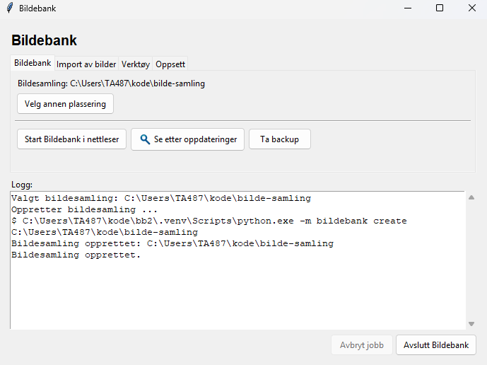
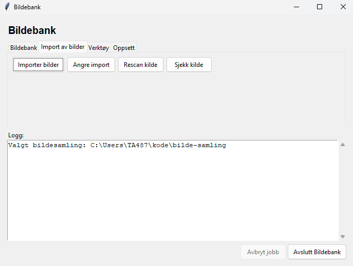
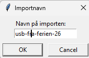
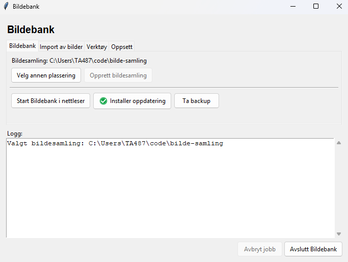
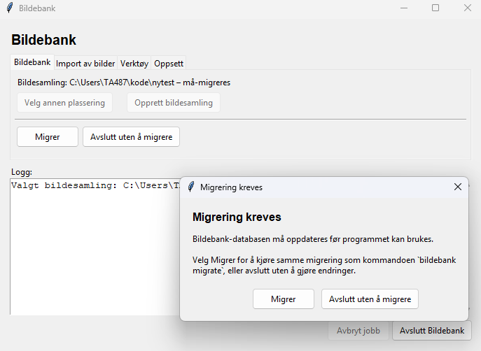

# Hvordan komme i gang med Bildebank

Vi fortsetter her der vi slapp i [README-filen](../../README.md). For å starte Bildebank
åpner du PowerShell og skriver følgende:

```powershell
bildebank start
```

Bildebank-vinduet vil da åpne seg:


Det første du må gjøre er å opprette en bildesamling. Dette er stedet der du
skal samle alle bildefilene. Som du ser i vinduet, har Bildebank allerede
foreslått et sted bildesamlingen kan lagres. I ditt Bildebank-vindu vil du
se at brukernavnet TA487 er erstattet med ditt brukernavn. For å opprette
bildesamlingen klikker du **Opprett bildesamling**. Hvis du vil plassere
bildesamlingen et annet sted, klikker du **Velg annen plassering** og
velger en annen tom mappe.

Når du har klikket **Opprett bildesamling**, ser vinduet slik ut:



I loggfeltet ser du kommandoen som opprettet bildesamlingen.
Knappen for å opprette bildesamling er også fjernet fordi bildesamlingen
er opprettet i valgt mappe. Hvis du vil opprette flere bildesamlinger eller
jobbe med en annen bildesamling, gjør du det med knappen **Velg annen plassering**.
Men jeg anbefaler å samle alt i en bildesamling.

Knappen **Start Bildebank i nettleser** starter Bildebank-serveren og åpner
bildesamlingen i nettleseren. Du kan klikke flere ganger på knappen for å
ha bildesamlingen åpen i flere nettleserfaner.

Knappen **Se etter oppdateringer** gjør nettopp det. Programmet sjekker også
automatisk etter oppdateringer når du starter det. Hvis det finnes oppdateringer,
endres knappen til **Installer oppdatering**.


## Importere bilder til bildesamlingen

For å importere bilder velger du først fanen "Import av bilder":



Når du trykker på knappen **Importer bilder**, får du først opp et vindu der du velger
mappen eller minnebrikken som inneholder bilder. Det gjør ingenting om bildene
allerede er delvis sortert i undermapper.

Når du har valgt mappe, får du opp et vindu der du blir bedt om å gi navn til importen:



Gi importen gjerne et navn som gjør at du holder oversikt over hva du har importert.
Du kan se listen over mapper som er importert [i nettleseren](/sources)
etter at du har startet Bildebank-serveren ved å klikke **Start Bildebank i nettleser**.

Hvis du importerer bilder fra mange CD-er eller minnebrikker, og de alltid
heter **F:\** på din PC, må du gi hver import et eget navn.

Når importen er fullført, skrives en oppsummering i loggvinduet. Eksempelet under
viser at 10 bilder ble skannet og importert, og at ingen av bildene allerede
fantes i bildesamlingen:

```text
Oppsummering: scannet=10, importert=10, duplikater=0, eksisterende=0, navnekollisjoner=0, feil=0
```

Hvis du prøver å bruke samme importnavn på nytt, stopper Bildebank. Velg et
nytt navn for en ny import.


## Se bildene i nettleser

For å se bildene i nettleseren velger du fanen "Bildebank" i vinduet og klikker
**Start Bildebank i nettleser**:


## Hente oppdateringer

Du kan se etter oppdateringer ved å klikke på knappen "Se etter oppdateringer"
i Bildebank-vinduet. Programmet vil også gjøre dette ved oppstart. Hvis knappen
endrer seg til "Installer oppdatering" betyr det at du kan oppdatere programmet
ved å klikke på knappen. Programmet laster da ned oppdateringen og starter seg
selv på nytt.



Hvis en oppdatering har ødelagt Bildebank-vinduet, slik at du ikke kan gjøre
nye oppdateringer derfra, kan dette gjøres fra PowerShell:

```powershell
bildebank update
```

Hvis `bildebank update` ikke virker, kan du kjøre oppdateringsskriptet direkte:

```powershell
cd $HOME\kode\bildebank
powershell.exe -ExecutionPolicy Bypass -File .\update.ps1
```

Hvis det heller ikke virker, kan du gjøre det manuelt:

```powershell
cd $HOME\kode\bildebank
git pull --ff-only
.\.venv\Scripts\python.exe -m pip install -e .
```

Deretter kan du bruke programmet som før. Disse siste alternativene er det
lite sannsynlig at du vil støte på. Hvis oppdateringsknappen ikke virker,
kan du gjerne kontakte Tom Cato før du prøver noe mer.

### Migrere gammel database

Noen programoppdateringer kan kreve at databasen i bildesamlingsmappen
oppgraderes før du kan importere eller gjøre andre endringer. Bildebank-vinduet
kan gjøre det, og da ser det slik ut:



Det er da helt trygt å klikke "Migrer". Det tas sikkerhetskopi av filen som endres,
og ingen bildefiler endres ved migrering.

Hvis du jobber med Bildebank fra PowerShell, oppgraderer du ved å gå til
mappen med bildesamlingen og kjøre `migrate`:

```powershell
cd $HOME\BildeSamling
bildebank migrate
```
Du kan kontrollere hva migreringen vil gjøre uten å endre databasen:

```powershell
bildebank migrate --check
```

Når `bildebank migrate` kjøres, lager programmet en sikkerhetskopi av `.bilder.sqlite3`
før databasen endres. Hvis migreringen feiler, skal databasen ikke oppgraderes,
og sikkerhetskopien beholdes.

## Angre import av en kilde

Hvis du har importert feil mappe, CD eller USB-disk, kan du bruke [`unimport`](../unimport.md)
eller trykke knappen "Angre import" i Bildebank-vinduet. Bildebank-vinduet lar deg
velge hva du vil angre, og lar deg bare kjøre kommandoen hvis filene fortsatt finnes utenfor
bildesamlingen, slik at ingen bilder mistes.

## Sikkerhet og sikkerhetskopier

Bildebank organiserer og kopierer bilder og videoer inn i en ny samling, og
har versjonert backup med `snapshot`. Én backupfunksjon eller én backupdisk
erstatter likevel ikke flere uavhengige sikkerhetskopier.

Ikke slett originalkilder etter import bare fordi Bildebank har kopiert filene.
Kontroller først at importen ser riktig ut, at `index.html` viser det du
forventer, og at bildesamlingen er sikkerhetskopiert til mer enn ett trygt sted.

En enkel regel er 3-2-1-regelen: ha minst 3 kopier av viktige filer, på minst
2 forskjellige lagringsmedier, og minst 1 kopi et annet sted enn hjemme.

Behold gamle kilder til du er sikker på at den nye samlingen er kontrollert og
sikkerhetskopiert.

Bruk [`snapshot`](../snapshot.md) for versjonerte sikkerhetskopier som kan
gjenopprette hele samlinger og enkeltfiler. Kommandoen
[`backup`](../backup.md) lager i stedet en speiling av slik samlingen ser ut nå.
